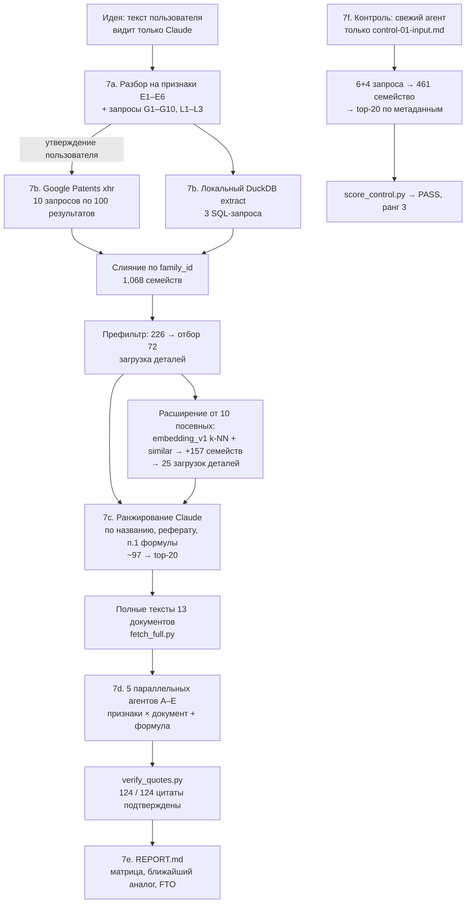

**«Конфиденциально: содержит описание непатентованной идеи. Перед распространением согласовать с автором идеи.»**

# ideacheck — отчёт по Фазе 0 (ручная проверка существующих инструментов)

_Период работ: 2026-10-01 — ранние часы 2026-10-02. Исполнитель: Claude Code (модель Claude Opus 5.5) под руководством пользователя. Источники: файлы проекта `/Users/andreyshulga/projects/experimental/valery/ideacheck` (список в Приложении Б). Все числа взяты из этих файлов или из данных о затратах, которые предоставил пользователь. Оценки помечены словом «оценка»._

_Документ является исследовательским материалом и **не является юридическим заключением** о патентоспособности или о свободе использования (FTO)._

---

## Содержание

1. Резюме для руководства
2. Цели и рамки Фазы 0
3. Методология
4. Материалы и инструменты
5. Результаты
6. Затраты
7. Наблюдения и выводы
8. Предложения по улучшению
9. Риски и ограничения
10. Предлагаемые следующие шаги
11. Приложения (А — глоссарий, Б — перечень файлов, В — расхождения в источниках)

---

## 1. Резюме для руководства

- **Цель.** До написания кода проверить, можно ли силами существующих инструментов (Claude + локальный MCP-сервер `patent-client-agents` + BigQuery `patents-public-data`) пройти весь путь: «идея → похожие патенты → извлечение данных → карта пересечений с идеей». Условия: сырой текст идеи видит только LLM, данные берутся только из BigQuery и бесплатных источников, охват мировой.
- **Что сделано.** Развёрнуто окружение, BigQuery работает в режиме sandbox. Стоимость запросов измерена через бесплатные dry-run. Выполнен один локальный извлекающий запрос (extract) на 197.1 GB: 246,285 публикаций, 117,264 патентных семейства, локальная база DuckDB на 128 MB. Написаны 7 вспомогательных скриптов. Весь конвейер прогнан вручную на реальной идее пользователя (idea 01) и на одном «слепом» контрольном тесте с известным ответом.
- **Воронка для idea 01.** 13 запросов (10 удалённых и 3 локальных) дали 1,068 семейств-кандидатов. Расширение от «посевных» патентов добавило ещё 157 семейств. Детально просмотрено 97 документов (около 100), в шорт-лист попали 20, полностью сравнены 13.
- **Ключевой результат по идее.** Ближайший аналог — **US-12564527-B2 (Hill-Rom, приоритет 2022, действует примерно до 2044)**. Он раскрывает признаки E1, E3, E4, E5, E6 и частично E2: поворот колеса там обеспечивается разностью скоростей двух колёс, а не отдельным приводом поворота. Вывод: идея **весьма вероятно не нова в текущей формулировке**.
- **Сигнал по FTO (по формуле, а не по описанию).** Ни один проверенный независимый пункт формулы действующих патентов не выполняется идеей полностью. У трёх патентов запас узкий: US-8756726-B2 (Hill-Rom), EP-2897566-B1 (Stryker), US-12564527-B2 (Hill-Rom). Для каждого найдены условия обхода.
- **Проверка цитат.** Все 124 из 124 положительных выводов подтверждены дословными цитатами из текста документа (скрипт `verify_quotes.py`).
- **Слепой контрольный тест прошёл (PASS).** Семейство-ответ (JP-4616127-B2 / JP-2007055480-A, Toshiba Tec) оказалось на **3-м месте из 20**. Но ранжирование выполнялось только по названиям и метаданным: Google Patents около часа блокировал загрузку деталей. Поэтому подтверждены только поиск и ранжирование по названиям.
- **Затраты.** Фактические денежные затраты — **$0**. Claude входит в подписку Team plan: израсходовано около 5% 5-часового окна и около 10% недельного лимита. BigQuery работает в sandbox: 197.1 GB, в пересчёте на тариф on-demand ≈ $1.2. По оценке, при оплате Claude через API по факту использования вышло бы порядка **$20–40**.
- **Главные риски.** (1) Неофициальный эндпоинт Google Patents жёстко ограничивает частоту запросов: блокировка случилась дважды за день, и это главный операционный риск. (2) Область extract не охватила классы всенаправленных платформ и колёсных модулей (B60K/B60B/B62D/B66F). (3) Данные Google о независимости пунктов формулы ненадёжны. (4) Заявки примерно за последние 18 месяцев ещё не опубликованы. (5) Выводы о пересечениях — это суждения LLM, а не мнение патентного поверенного.
- **Рекомендуемые шаги.** Подключить ключ EPO OPS и резервные источники полных текстов. Добавить постоянный кэш загрузок. Расширить extract за один прогон примерно на 197 GB. Изолировать рабочие каталоги агентов. Провести ещё несколько слепых контрольных тестов с ранжированием по полному тексту. Затем решить, переходить ли к Фазе 1 (CLI). Варианты приведены в §10.
- **Отклонение от плана.** PLAN.md отводил на Фазу 0 «около половины дня» и предлагал взять неконфиденциальную идею. Фактически работа по временным меткам файлов шла примерно с 09:45 до 21:28 и далее, на реальной конфиденциальной идее и с отдельным контрольным тестом.

---

## 2. Цели и рамки Фазы 0

### 2.1. Что проверялось

Фаза 0 по PLAN.md §6 — это ручная проверка без кода варианта A: Claude плюс MCP-сервер (MCP, Model Context Protocol — протокол подключения внешних инструментов к LLM). Проверялось следующее:

1. Работают ли локально `patent-client-agents` (доступ к Google Patents, EPO, USPTO, CPC) и BigQuery `patents-public-data`.
2. Сколько реально стоят разные типы запросов к BigQuery и насколько свежи исследовательские таблицы Google (`similar[]`, `embedding_v1`).
3. Можно ли пройти конвейер из PLAN.md §5 (разбор идеи → запросы → поиск → ранжирование → полные тексты → сравнение → отчёт) и насколько полон поиск.
4. Можно ли предотвратить «галлюцинации» LLM, требуя дословную цитату к каждому выводу.
5. Сколько времени занимает каждый этап и где узкие места. От этого зависит, что автоматизировать в Фазах 1–2.

### 2.2. Ограничения, заданные пользователем

| Ограничение | Как соблюдалось |
|---|---|
| **Приватность:** сырой текст идеи видит только LLM (Claude) | В Google Patents уходили только согласованные короткие ключевые слова и классы CPC (`queries-idea-01.md`). Текст идеи, список признаков и контекст применения не отправлялись. Сравнение выполнялось по локальным файлам, а агентам сравнения сеть была запрещена (`compare/INSTRUCTIONS.md`). Публичный демо-сервер `mcp.patentclient.com` не использовался, MCP-сервер запускался локально через stdio (`.mcp.json`). |
| **Бюджет:** только BigQuery и бесплатные источники, без платных API | BigQuery в режиме sandbox (биллинг отключён, жёсткий лимит 1 TB/мес). Google Patents — через неофициальный бесплатный эндпоинт. PQAI и SaaS-сервисы исключены. |
| **Мировой охват** | Google Patents ищет по всем ведомствам. В extract вошли все страны (крупнейшие: US, CN, DE, EP, GB, WO, KR, FR, JP). |

**Остаточный риск приватности**, принятый пользователем (`queries-idea-01.md`): Google видит каждый запрос отдельно и теоретически может связать их (один IP, одна сессия) в общую картину вида «управляемые ведущие колёса + диагональ + самоориентирующиеся колёса + усилие на рукоятке».

### 2.3. Вне рамок Фазы 0

- Написание продуктового кода (CLI, библиотека, MCP-обёртка, веб-интерфейс): это Фазы 1–3.
- Ранжирование локальной embedding-моделью: в Фазе 0 ранжировал сам Claude.
- Компонентный префильтр (этап 5b PLAN.md).
- Проверка семейств патентов по юрисдикциям (US/EP/CN/JP) и юридического статуса через EPO OPS: ключа EPO OPS не было.
- Непатентная литература (NPL) и мониторинг новых публикаций.
- Юридическая экспертиза. Отчёт не является юридическим заключением.

---

## 3. Методология

### 3.1. Схема конвейера (как выполнялся фактически)



Тот же конвейер в ASCII:

```
idea-01 (конфиденциально, только Claude)
  │ 7a  признаки E1–E6 + запросы ──[утверждение пользователя]──┐
  ▼                                                            ▼
Google Patents xhr (G1–G10) + DuckDB extract (L1–L3) ──► 1,068 семейств
  │ префильтр 226 → детали 72      расширение от посевных: +157 → детали 25
  ▼ 7c  ранжирование Claude (~97 документов) ──► top-20 (shortlist.md)
  ▼ 7d  полные тексты 13 → 5 агентов → compare/*.json → verify_quotes → 124/124
  ▼ 7e  REPORT.md
7f  слепой контроль: control-01-input.md → 461 семейство → ranked.json → ранг 3/20
```

### 3.2. Пошаговое описание

Номера шагов соответствуют PLAN.md §6 и журналу `phase0/findings.md`.

| Шаг | Что сделано | Кто | Результат |
|---|---|---|---|
| **Подготовка** | Обзор трёх awesome-списков и отдельных репозиториев, выбор инструментов (PLAN.md §2–3). Репозитории LeonardHope разбирались по просьбе пользователя (§3a). | Claude, по запросу пользователя | PLAN.md |
| **1–2. Окружение** | Python 3.11.13, uv 0.8.12, gcloud 586. `patent-client-agents` 0.29.0 запущен как локальный stdio MCP-сервер (136 инструментов). Найдена несовместимость с fastmcp 4.x, версия закреплена `fastmcp<4`. | Claude | `.mcp.json`, `requirements-phase0.txt` |
| **3. Проект GCP** | Проект `patent-landscape-ashulga`. Биллинг не включён, поэтому работает BigQuery sandbox. Расход за сентябрь — 175 GB (8 заданий, предыдущий отдельный эксперимент). | Пользователь (проект и учётные данные), Claude (проверка) | findings.md |
| **4. Затраты BigQuery** | Бесплатные dry-run для каждого столбца и для типовых запросов. | Claude, `dryrun_costs.sh` | `dryrun_costs.md`, PLAN.md §7a |
| **5–6. Extract и свежесть** | Один извлекающий запрос с префиксами CPC `B62B`, `A61G7/`, `A61G1/` в локальную DuckDB. Проверены свежесть данных и заполненность `similar[]` и `embedding_v1`. | Claude, `extract.py`. Отдельное подтверждение запуска на 197 GB **в файлах не зафиксировано**. Защита — лимит `--max-gb 210`. | `data/extract.duckdb` |
| **Подготовка idea 01** | Идея разложена на признаки E1–E6. Классы CPC проверены по реальным патентам, потому что `lookup_cpc` требует ключ EPO OPS. | Claude | `idea-01-power-assist-cart.md` |
| **Контрольная точка 1** | **Уточнения пользователя** (2026-10-01): E3 — пассивные колёса самоориентирующиеся; E5 — вектор только поступательный, без поворота на месте. | **Пользователь** | раздел «Clarifications» |
| **7a. Запросы** | Составлены 10 удалённых запросов (G1–G10) и 3 локальных (L1–L3) плюс правило расширения L4. | Claude | `queries-idea-01.md`, `queries.json` |
| **Контрольная точка 2** | **Утверждение запросов пользователем** перед отправкой в Google («waiting for user approval»). | **Пользователь** | `queries-idea-01.md` |
| **7b. Поиск** | Удалённые и локальные запросы, слияние по `family_id`, загрузка деталей, расширение от 10 посевных патентов через `embedding_v1` k-NN и `similar[]`. | Claude, `retrieve.py`, `fetch_details.py` | `candidates.json`, `expansion.json`, `details*.json` |
| **7c. Ранжирование** | Claude ранжировал около 100 кандидатов по названию, реферату и пункту 1 формулы за один проход чтения. | Claude | `shortlist.md` (top-20) |
| **7d. Сравнение** | Загружены полные тексты 13 документов (~930 тыс. символов описаний). Работу разделили между 5 параллельными агентами A–E, по 2–3 документа на агента, примерно по 2.5–4.5 мин на агента. По каждому документу: раскрытие признаков E1–E6 и сопоставление с независимыми пунктами формулы действующих патентов. К каждому положительному выводу — обязательная дословная цитата. | Агенты A–E, `fetch_full.py`, `compare/INSTRUCTIONS.md` | `compare/<PUB>.json` |
| **Проверка цитат** | Программная проверка: цитата должна быть подстрокой текста документа с точностью до пробелов. Неподтверждённые выводы понижаются до «unverified». | `verify_quotes.py` | `compare/verified.json` |
| **7e. Отчёт** | Матрица признаков, ближайший аналог, пересечение с формулой, запасы для обхода, ограничения. Зависимость п. 21 US-12564527-B2 проверена вручную. | Claude | `runs/idea-01/REPORT.md` |
| **7f. Слепой контроль** | Новый агент получил только `control-01-input.md` (без номера, заявителя и года). Ему было запрещено читать файл ответа и файлы idea 01, писать он мог только в `runs/control-01/`. | Отдельный агент. **Координатор остановил его попытки загрузки** во время блокировки Google. | `ranked.json`, `method.md` |
| **Оценка контроля** | Проверка, попало ли семейство 37919331 в top-20, и на каком этапе его можно было потерять. | `score_control.py` | PASS, ранг 3 |

### 3.3. Принципы, которые соблюдались

- **Только ключевые слова наружу.** Каждый удалённый запрос — это AND-комбинация коротких групп синонимов, иногда с фильтром CPC.
- **Независимые пункты формулы, а не рефераты**, используются для вывода о пересечении. Рефераты нужны только на этапе отбора.
- **Обязательная цитата:** 8–40 слов, дословно, с проверкой строковым сравнением.
- **Строгость:** omni-колесо или колесо Mecanum не считается колесом «steer-and-drive». Пункт формулы «выполнен» (`all_met`), только если выполнены все его ограничения (limitations).
- **Слепота контроля.** Сессия, которая знала idea 01, сама генерировала запросы и ранжировала, а это источник предвзятости. Поэтому для контроля шаги 7a–7c выполнял отдельный «свежий» агент.

---

## 4. Материалы и инструменты

### 4.1. Выбор инструментов (кратко по PLAN.md §2–3)

Ни один существующий инструмент не покрывает весь процесс. Поиск и доступ к данным покрыты хорошо, а сопоставление идеи с формулой («intersection engine») не покрыто ничем. Его и предстоит строить.

| Инструмент / репозиторий | Решение | Причина |
|---|---|---|
| `parkerhancock/patent-client-agents` (Apache-2.0) | ✅ **Используется** как основной слой данных | Google Patents (поиск, полный текст, формула, цитирования, семейства), EPO OPS, USPTO, CPC. Работает и как библиотека, и как MCP-сервер. **Минус:** Google Patents доступен через неофициальный `patents.google.com/xhr/query`. Поиск только по ключевым словам и фильтрам, семантического поиска нет. |
| BigQuery `patents-public-data` | ✅ **Используется** через разовый локальный extract | Официальные стабильные данные: CPC, `family_id`, цитирования, `similar[]`, `embedding_v1`. Таблицы не кластеризованы, поэтому живые запросы дороги (§5.1). |
| `google/patents-public-data` (репозиторий, в архиве) | 📖 Справочно | Ноутбуки с примерами расширения через `similar` и embedding. |
| Claude-Patent-Creator | 📖 Справочно | Ориентирован на составление заявок в США и выдаёт вердикт, а не матрицу пересечений. |
| LeonardHope/Claude-Skill-for-Patent-Landscape-Analysis (MIT) | 📖 Частичное заимствование в Фазе 1 | Отвечает на вопрос «кто патентует в области», а не «что пересекается с идеей». Ценны схема `PatentRecord`, дедупликация по семействам, provenance и одностраничный HTML-отчёт. |
| LeonardHope/Google-Patents-Natural-Language-API-Search (Apache-2.0) | 📖 Частичное заимствование | Защита стоимости (dry-run + лимит байт) и SQL-шаблоны. В `find_similar_patents` замечено вероятно неверное имя столбца (`similar_documents` вместо `similar`); это не проверялось вживую. |
| vserifoglu/bq-ai-patent-analyst (CC-BY-4.0) | 📖 Только идея | Сопоставление на уровне компонентов («компонент + функция»). Сам проект — демо на ~400 PDF, зависит от Gemini/Vertex: платно и второй провайдер LLM видит идею. |
| PQAI (облачный API) | ❌ Отклонён | Платный или академический токен, только США, идея уходит в их облако. |
| `patent_mcp_server` | ⚪ Опционально | Только USPTO. Может служить резервом для полного текста документов США. |
| python-epo-ops-client / epo-cli | ⚪ Покрыто | Уже обёрнуто в `patent-client-agents` (нужен бесплатный ключ). |
| Lens.org | ⚪ Позже | Бесплатный уровень по одобренному токену, научная литература. |
| patzilla, P2N-v3, PatentInspector, patent_client, pypatent, инструменты на PatentsView | ❌ Отклонены | Устарели, лицензия AGPL, в архиве, либо API закрыт (PatentsView API закрыт 2026-03-20). |
| SaaS (PatSnap, Derwent, Orbit и др.) | ❌ Отклонены | Вне бюджета. |

### 4.2. Источники данных

| Источник | Что использовалось | Стоимость / ограничения |
|---|---|---|
| Google Patents (через `patent-client-agents`) | Поиск по ключевым словам и CPC; детали (реферат, формула, `structured_limitations`, статус); полные тексты | $0. Неофициальный эндпоинт с ограничением частоты: 503 примерно после 10 поисков и нескольких запросов деталей. |
| BigQuery `patents.publications` (3.17 TB) | Идентификаторы, даты, `cpc.code`, английское название, `assignee_harmonized.name` | Sandbox, 1 TB/мес. Таблица не кластеризована и не партиционирована. |
| BigQuery `google_patents_research.publications` (0.52 TB) | `similar.publication_number`, `embedding_v1` | Аналогично. `similar[]` отстаёт на 4–5 месяцев. |
| Локальная DuckDB `data/extract.duckdb` (128 MB) | Локальный поиск по названиям и CPC, k-NN по `embedding_v1`, `similar[]` | Бесплатно, офлайн, наружу ничего не уходит. |

### 4.3. Созданные скрипты (`scripts/phase0/`)

| Скрипт | Назначение |
|---|---|
| `dryrun_costs.sh` | Dry-run в BigQuery: стоимость каждого столбца, вложенных подполей и типовых запросов. Результат — Markdown-таблица. Бесплатно. |
| `extract.py` | Разовый extract из BigQuery в локальную DuckDB. Читает только нужные столбцы и подполя, фильтрует по префиксам CPC (`B62B`, `A61G7/`, `A61G1/`). Режим `--dry-run`; жёсткий лимит `maximum_bytes_billed` через `--max-gb` (по умолчанию 210). |
| `retrieve.py` | Выполняет утверждённый `queries.json`: удалённые запросы к Google Patents (до 100 результатов, пауза 3 с) и локальные SQL. Сливает результаты по `family_id` и записывает, какой запрос нашёл каждого кандидата. Результат — `remote_hits.json`, `candidates.json`. |
| `fetch_details.py` | Возобновляемая «вежливая» загрузка деталей: название, реферат, до 3 независимых пунктов (по регулярному выражению), `structured_limitations`, даты, статус. Сохраняет после каждой записи, пропускает уже загруженные, пробует разные формы номера (US 10/11 цифр). |
| `fetch_full.py` | Загрузка полного документа (вся формула, ограничения, описание) для глубокого сравнения, по одному JSON на документ. |
| `verify_quotes.py` | Проверяет, что каждая цитата в `compare/*.json` — дословная подстрока источника (с нормализацией пробелов). Неподтверждённые выводы понижает до «unverified» и записывает `verified.json`. |
| `score_control.py` | Оценивает слепой контроль: есть ли семейство-ответ среди кандидатов, в загруженных деталях и в top-20. Выдаёт PASS/FAIL. |

### 4.4. Окружение

- `.mcp.json`: один локальный stdio-сервер `patent-client-agents`, запускается из `.venv`.
- `requirements-phase0.txt`: `patent-client-agents[mcp]==0.29.0`, `fastmcp>=3.2.3,<4`, `google-cloud-bigquery>=3.25`, `google-cloud-bigquery-storage`, `pyarrow`, `duckdb`, `db-dtypes`.

### 4.5. Артефакты данных

| Артефакт | Размер / объём | Содержание |
|---|---|---|
| `data/extract.duckdb` | 128 MB (128,462,848 байт) | 246,285 публикаций, 117,264 семейства |
| `runs/idea-01/` (всего) | ~2.6 MB | Весь след поиска и сравнения |
| `runs/idea-01/candidates.json` | ~264 KB, 1,068 семейств | Объединённые кандидаты с атрибуцией по запросам |
| `runs/idea-01/remote_hits.json` | ~180 KB | Сырые ответы G1–G10 (929 результатов) |
| `runs/idea-01/prefilter.json` | ~59 KB, 226 записей | Промежуточный предотобор. Критерий: семейство найдено ≥2 запросами **или** вошло в первые 15 результатов любого удалённого запроса G1–G10. |
| `runs/idea-01/details.json` | ~531 KB, 72 записи, 0 ошибок | Детали отобранных кандидатов (`triage_ids.txt`) |
| `runs/idea-01/expansion.json` | ~26 KB, 157 семейств | Расширение от посевных патентов |
| `runs/idea-01/details_expansion.json` | ~183 KB, 25 записей, 0 ошибок | Детали отобранных из расширения (`expansion_ids.txt`) |
| `runs/idea-01/full/` | ~1.2 MB, 13 файлов | Полные тексты (описания ~929 тыс. символов, с формулой ~971 тыс.) |
| `runs/idea-01/compare/` | 13 файлов + `verified.json` (~92 KB) | Вердикты по документам |
| `runs/control-01/` | ~240 KB | Кандидаты (461 семейство), `ranked.json`, `method.md`, `work/` |

---

## 5. Результаты

### 5.1. Затраты BigQuery по данным dry-run (основа решения о локальном extract)

Таблицы не кластеризованы и не партиционированы, поэтому **стоимость запроса — это сумма прочитанных столбцов и подполей. Фильтр `WHERE` и размер подмножества CPC её не уменьшают** (PLAN.md §7a, `dryrun_costs.md`).

| Сценарий | Объём сканирования | Решение |
|---|---|---|
| Компактный индекс (ids, даты, `cpc.code`, название EN, `assignee.name`) | 42.8 GB (≈43) | ✅ |
| Компактный индекс + `similar.publication_number` + `embedding_v1` (join) | 195.7 GB (≈196) | ✅ Не чаще раза в месяц, сразу с максимально широким набором CPC |
| Рефераты (`abstract_localized.text`) | 212.8 GB | ❌ Брать из Google Patents |
| Формула (`claims_localized`), даже для одного патента | 125 GB | ❌ Никогда |
| Живой `similar[]` по одному патенту | 64.2 GB | ❌ Только из extract |
| Живой k-NN по `embedding_v1` | 91.4 GB | ❌ Только локально |
| Поиск по ключевым словам в названии + реферате | 232.4 GB | ❌ Google xhr или extract |
| Описание (`description_localized`) | 1154.8 GB | ❌ |

**Фактический extract** (`extract.py`): списано 197.1 GB; dry-run самого `extract.py` показал те же 197.1 GB. Цифра 195.7 GB в `dryrun_costs.md` относится к чуть более узкому пробному запросу без поля `publication_date`. Скачано 246,285 публикаций (117,264 семейства) за 183 с.

**Свежесть и полнота данных:**
- Последняя дата публикации — 2026-09-17, отставание около двух недель.
- `embedding_v1` заполнен на 100% для всех лет, включая сентябрь 2026.
- `similar[]` заполнен на ~99–100% до апреля 2026, на 68% в мае 2026 и **на 0% с июня 2026**. Отставание 4–5 месяцев.
- Английские названия есть у 79.4% строк. Остальные записи — непереведённые неанглоязычные, но у них есть англоязычный член семейства.
- Крупнейшие страны в extract: US 58k, CN 49k, DE 23k, EP 21k, GB 14k, WO 12k, KR 12k, FR 10k, JP 8k.

### 5.2. Воронка поиска для idea 01

| Этап | Количество | Источник |
|---|---|---|
| Удалённые запросы Google Patents (G1–G10) | 10 запросов → 929 результатов (по 100 у G1–G8, 91 у G9, 38 у G10) | `remote_hits.json` |
| Локальные запросы (L1–L3) | L1: 116, L2: 59, L3: 100 | `candidates.json` (поле `found_by`) |
| **Семейства-кандидаты после слияния** | **1,068** | `candidates.json` |
| Предотбор | 226 | `prefilter.json` |
| Загрузка деталей (основной поток) | 72 (0 ошибок) | `triage_ids.txt`, `details.json` |
| Расширение от 10 посевных (`embedding_v1` k-NN + `similar[]`, L4) | +157 семейств (**отдельно от 1,068**) | `expansion.json` |
| Загрузка деталей (из расширения) | 25 (0 ошибок) | `expansion_ids.txt`, `details_expansion.json` |
| **Просмотрено Claude по названию, реферату и п. 1** | **97 (≈100)** | findings.md 7c |
| Шорт-лист | 20 | `shortlist.md` |
| **Полное сравнение** | **13** (позиции шорт-листа 1–10, 15, 16, 17) | `deep_ids.txt`, `full/`, `compare/` |

Важные наблюдения о воронке:
- 5 полнотекстовых запросов без фильтра CPC (G1, G2, G5, G6, G10) дали в основном шум: хирургические роботы, связь «автомобиль–автомобиль», лидары.
- **Локальный поиск по названиям (L1) нашёл близкие аналоги, которые удалённые запросы ранжировали низко или пропустили:** DE-202004010854-U1 и US-2019183707-A1.
- 3 из 10 посевных патентов отсутствуют в extract (JP-2008137631-A, JP-2014046890-A, JP-6837910-B2): их классы лежат вне B62B/A61G, вероятно в B60K/B60B/B62D.

### 5.3. Признаки idea 01 (описание на уровне признаков)

| # | Признак |
|---|---|
| E1 | Четырёхколёсное основание (тележка, платформа, кровать на колёсах) для тяжёлых грузов или деликатной перевозки |
| E2 | Ровно **два** из четырёх колёс активные, каждое с **приводом хода и приводом поворота на 360°** (модуль «steer-and-drive», «swerve») |
| E3 | Активные колёса расположены **по диагонали**, два других — **пассивные самоориентирующиеся** (free-swivel casters) |
| E4 | Интерфейс: эргономичный руль, джойстик или датчики в рукоятках тележки |
| E5 | **Усилие пользователя на рукоятках** измеряется и преобразуется в **вектор желаемого движения** с учётом мгновенной скорости и ускорения. Движение только поступательное, без команды поворота |
| E6 | Вектор преобразуется в команды для активных колёс: угол поворота и тяга для каждого из двух колёс |

Контексты применения: строительные магазины и склады (тяжёлые грузы, препятствия), медицинские кровати (плавность, осторожность).

### 5.4. Матрица признаков (13 документов, полное сравнение)

Обозначения: ● раскрыт · ◐ частично · ○ не найден. Каждый ● и ◐ подтверждён проверенной цитатой. Значения совпадают в `REPORT.md` и `compare/verified.json`.

| # | Документ | Заявитель, приоритет, статус | E1 | E2 | E3 | E4 | E5 | E6 | Главное отличие от идеи |
|---|---|---|---|---|---|---|---|---|---|
| 1 | **US-12564527-B2** | Hill-Rom, 2022, **действует** | ● | ◐ | ● | ● | ● | ● | Поворот за счёт двухколёсного дифференциального колеса, без отдельного мотора поворота |
| 2 | **JP-2008137631-A** | Mitsuba, 2006, отозвана | ● | ◐ | ● | ● | ◐ | ◐ | Дифференциальный поворот; ввод рычагом, а не усилием на рукоятке; нет учёта скорости и ускорения |
| 3 | **EP-2897566-B1** | Stryker, 2012, **действует** | ● | ◐ | ◐ | ● | ◐ | ● | Два ведущих управляемых колеса рядом + 4 пассивных (6 колёс); поворот выше порога скорости |
| 4 | US-2019183707-A1 | Info Solution, 2016, брошена | ◐ | ◐ | ◐ | ● | ◐ | ● | Настоящие swerve-колёса, но в отдельном 3-колёсном тягаче для кровати; джойстик |
| 5 | JP-7853860-B2 | Honda, 2021, **действует** | ● | ◐ | ◐ | ● | ◐ | ◐ | Задние omni-колёса рядом, без поворота |
| 6 | JP-2023019525-A | Honda, 2021, **действует** | ● | ◐ | ◐ | ● | ◐ | ◐ | П. 9: усилие → целевой вектор скорости |
| 7 | JP-2023144611-A | Honda, 2022, **действует** | ● | ◐ | ◐ | ● | ◐ | ◐ | Дополнительно рыскание (yaw) от момента скручивания рукоятки |
| 8 | DE-202004010854-U1 | Expresso, 2004, истёк | ● | ◐ | ◐ | ● | ◐ | ◐ | Два неповоротных задних ведущих колеса на одной оси, поворот разностью скоростей |
| 9 | DE-102004033572-A1 | Expresso, 2004, отозвана | ● | ◐ | ◐ | ● | ◐ | ◐ | Как № 8 |
| 10 | JP-7570286-B2 | JTEKT, 2021, **действует** | ● | ◐ | ◐ | ◐ | ◐ | ◐ | Модуль Mecanum под кроватью; диагональная расстановка упомянута как вариант |
| 11 | JP-6837910-B2 | THK, 2017, **действует** | ◐ | ● | ◐ | ○ | ○ | ◐ | **Настоящие активные колёса steer-and-drive** (2 активных + 2 пассивных), но рядом, без усилия на рукоятке |
| 12 | US-8756726-B2 | Hill-Rom, 2006, **действует** | ◐ | ◐ | ◐ | ● | ◐ | ◐ | Одно центральное ведущее колесо, поворот на 90°; боковой режим выбирается кнопками |
| 13 | JP-2014046890-A | Araki, 2012, рассматривается* | ◐ | ○ | ◐ | ● | ◐ | ◐ | Неуправляемые omni-колёса + четыре пассивных; 3-осевой датчик нагрузки в рукоятке |

\* В `shortlist.md` и `REPORT.md` статус указан как «pending». В `full/` и `verified.json` значится `legal_status: active`, поэтому для заявки выполнялась проверка пересечения с формулой. Противоречия нет: «Pending» — это статус заявки (ещё не выдан патент), а `legal_status: active` означает, что заявка в силе.

**Итог по матрице.** Каждый признак хотя бы частично раскрыт в нескольких документах. Комбинация **E2 + E3 + E4 + E5 + E6** почти полностью присутствует в документе № 1. Отличается только механизм поворота в E2.

### 5.5. Ближайший аналог и вывод о новизне

**US-12564527-B2 (Hill-Rom Services Inc., приоритет 2022-03-07, срок ≈ 2044-09-03).** По проверенным цитатам из `REPORT.md` §3:
- четыре колеса: два свободно поворачивающихся одноколёсных немоторизованных и два двухколёсных моторизованных;
- п. 21 формулы: колёса расположены по диагонали воображаемого прямоугольника;
- датчики нагрузки (load cells) в толкающих рукоятках;
- сигналы двух рукояток суммируются и с помощью тригонометрии превращаются в виртуальную команду скорости и направления;
- замкнутый контур управления по ускорениям, скорости рыскания и скоростям колёс;
- отдельный угол поворота и привод на каждое колесо, есть режим без рыскания (только поступательное движение).

**Остающиеся отличия невелики и известны из других документов:**
1. *Механизм поворота.* У Hill-Rom колесо поворачивается за счёт разности скоростей двух его колёс, в идее предусмотрен отдельный привод поворота (swerve). Модули с отдельным мотором поворота известны из THK JP-6837910-B2 и Stryker EP-2897566-B1. Предшествующий уровень техники, цитируемый в Mitsuba JP-2008137631-A, описывает пару ведущих и пару холостых колёс по диагонали, причём ведущее колесо поворачивается мотором. Сам Hill-Rom указывает, что подход применим и к одноколёсным моторизованным колёсам.
2. *Только поступательное движение.* У Hill-Rom это выбираемый режим, в идее — единственный. Это конструктивный выбор, а не технический вклад.
3. *Применение к тележкам магазинов и складов.* Hill-Rom заявляет применимость к другим маневрируемым устройствам на колёсах. Mitsuba уже описывает заводскую и складскую тележку.

**Вывод:** идея **весьма вероятно не нова в текущей формулировке**. Заявка на идею в таком виде, вероятно, будет отклонена из-за отсутствия новизны или изобретательского уровня: US-12564527-B2 в сочетании с THK, Stryker или фоном Mitsuba. Патентоспособный вклад, если он есть, нужно искать в более конкретном техническом решении, например:
- как именно мгновенная скорость и ускорение формируют преобразование «усилие → вектор» (компенсация инерции тяжёлого груза, мягкие ограничения для кроватей);
- как согласуются два диагональных модуля, чтобы база с двумя пассивными колёсами шла чисто поступательно без «дрожания» (flutter) самоориентирующихся колёс;
- как обрабатываются переходные процессы переориентации колёс при смене направления;
- поведение у препятствий и на уклоне;
- конкретная конструкция датчика в рукоятке или компоновка модулей.

Каждое из этих направлений требует отдельного поиска: Panasonic WO-2012063476-A1 и Stryker уже затрагивают поведение, зависящее от скорости.

### 5.6. Пересечение с формулой (сигнал FTO) и запасы для обхода

Рассматривались только независимые пункты формулы действующих патентов. Счёт «да / нет / неясно» приведён по ограничениям пункта. Значения в `REPORT.md` §4 и `verified.json` совпадают. **Ни один пункт не выполнен полностью** (`all_met_verified = false` у всех).

| Патент (срок ≈) | Пункт | да / нет / неясно | Запас и чего избегать в продукте |
|---|---|---|---|
| **US-8756726-B2** Hill-Rom (≈2028) | 1; 21 | 7/0/1; 6/0/1 | **Узкий.** Выполнено всё, кроме требования раздельных, разнесённых органов управления для продольного и иных направлений. Единый непрерывный вектор усилия обходит пункт, отдельные кнопки «вперёд» и «вбок» — нет. |
| **EP-2897566-B1** Stryker (≈2032, страны EP) | 1; 13 (способ) | 6/1/1; 1/1/1 | **Узкий.** Для кровати выполнены все конструктивные ограничения. Единственное «нет» — использование момента усилия толкания для усиления поворота. Если продукт когда-либо поворачивает в ответ на нецентральный толчок, п. 1, вероятно, читается на него. Отсюда требование строго поступательного движения. |
| **US-12564527-B2** Hill-Rom (≈2044) | 1 | 2/0/3 | Требует двухколёсных дифференциальных моторизованных колёс и джойстика, который в «мёртвой зоне» поворачивает колёса до начала движения. Одноколёсные модули с отдельным мотором поворота, управляемые усилием на рукоятке, остаются вне п. 1. П. 21 (диагональ) зависит от п. 1; это проверено вручную. |
| JP-7853860-B2 / JP-2023019525-A / JP-2023144611-A Honda (≈2041–42) | 1 / 1, 9 / 1 | 4/2/2 · 6/2/2 (п. 1 и п. 9) · 3/6/1 | Требуют всенаправленных (omni) колёс, steer-and-drive колёса их обходят. Ближе всех п. 9 JP-2023019525-A (усилие → целевой вектор скорости): не выполнены только ограничения про omni-колесо и формулировку привода. |
| JP-6837910-B2 THK (≈2037) | 1 | 4/0/5 | Требует выноса колеса (caster offset), актуатора поворота и мотора хода на стороне корпуса, передачи через ось поворота и зеркальных модулей. Мотор в колесе (in-wheel) или модуль без выноса обходят пункт. |
| JP-7570286-B2 JTEKT (≈2041) | 1 | 2/5/0 | Требует колёс Mecanum и управления по обнулению деформации. Обходится. |
| JP-2014046890-A Araki (заявка) | 1; 2 | 1/6/1; 1/6/1 | Требует omni-колёс. Обходится. |

**Условия обхода для продукта без лицензии** (REPORT.md §5):
- одноколёсные steer-and-drive модули, а не двухколёсные дифференциальные;
- один непрерывный ввод вектора усилия, без отдельных кнопок направления;
- строго никакой реакции рысканием на нецентральный толчок, как минимум для рынков EP примерно до 2032.

**Оговорки:**
- проверены отдельные публикации, а **члены семейств в других странах могут иметь другую формулу**. Семейства Hill-Rom и Stryker нужно проверить в US, EP, CN и JP до любого продуктового решения;
- «неясно» означает, что идея не уточняет эту деталь, и ответ определит конструкция продукта;
- ручная проверка зависимости выполнена только для п. 21 US-12564527-B2. Остальные пары пунктов в отчёте указаны как независимые.

### 5.7. Проверка цитат: 124 из 124

| Тип положительного вывода | Количество |
|---|---|
| Раскрытие признака (`disclosed`/`partial`) по 13 документам × 6 признаков = 78, минус 3 «absent» | 75 |
| Ограничения формулы со статусом «yes» | 49 |
| **Всего проверено / не прошло** | **124 / 0** |

Что это доказывает и чего не доказывает:
- ✅ Каждая цитата действительно присутствует в тексте документа (подстрока с нормализацией пробелов). Ссылок на несуществующий текст нет.
- ❌ Проверка **не подтверждает правильность вердикта**: цитата существует, но вывод из неё («раскрыто», «выполнено») остаётся суждением LLM. Отрицательные вердикты («absent», «no») цитатами не подкреплены и не проверялись.

### 5.8. Слепой контрольный тест (control-01)

**Постановка.** Скрытый ответ — JP4616127B2 (Toshiba Tec, «Power assist vehicle», приоритет 2005-08-25, семейство 37919331). Вход для агента — простое описание идеи (тележка с усилителем, датчики усилия в рукоятке, датчики препятствий, виртуальная «отталкивающая» сила от препятствий, суммирование с усилием оператора) с признаками C1–C5. Критерий PASS: ответ или любой член его семейства в top-20.

**Ход выполнения:**
- Агент сам подобрал классы (B62B5/0069, B62B5/0026) и узкие фразы («virtual repulsive force», «repulsive force» + obstacle + operating force + assist).
- 6 удалённых запросов (R1: 45, R2: 100 из 280, R3: 46 из 50, R4: 14, R5: 100 из 2062, R6: 100 из 716) и 4 локальных (L1: 6, L2: 0, L3: 4, L4: 424) дали **461 семейство**. R5 и R6 оказались шумными.
- **Семейство-ответ нашли независимо 3 из 6 запросов:** R1 (позиция 32), R3 (32), R4 (8).
- Расширение через k-NN и `similar` от 10 посевных добавило несколько семейств. Шесть посевных имели пустые embedding и были отброшены.
- Загрузка деталей не удалась: все запросы получали 503 или тайм-аут начиная с 20:31 (последняя проба в 21:27 по `work/fetch.log`). Координатор остановил попытки, `details.json` остался практически пустым (2 записи с ошибкой).
- Ранжирование проводилось только по названиям, CPC, заявителям, датам, атрибуции запросов и расширению.

**Результат: PASS, ответ на 3-м месте из 20** (JP-2007055480-A — опубликованная заявка того же семейства, что JP-4616127-B2). Места 1, 2 и 4 занимают патенты Panasonic «electric vehicle» (2009–2011), которые также используют виртуальную отталкивающую силу (JP-5186041-B2, US-8676420-B2, EP-2743121-B1). Это правдоподобные близкие аналоги, а не шум, но их содержание не проверялось.

**Что тест доказывает:**
- поиск на ключевых словах и CPC, сгенерированных «вслепую», находит известный ответ, причём несколькими независимыми запросами;
- ранжирование по названиям и метаданным выводит его в top-3.

**Что тест НЕ доказывает:**
- качество ранжирования по реферату и формуле и качество сравнения (шаги 7c–7d с текстом не выполнялись);
- полноту поиска для классов вне extract: класс ответа (B62B) лежал внутри области extract;
- независимость от формулировки: вход писала сессия, знавшая ответ, и он содержит фразу «virtual repulsive force», которую дословно нашли запросы R3/R4. Реальная идея может быть сформулирована иначе;
- статистическую надёжность: это один контрольный пример.

---

## 6. Затраты

### 6.1. Сводная таблица

| Статья | Измерено (факт) | Оценка | Комментарий |
|---|---|---|---|
| **Claude — денежные затраты** | **$0** (дополнительная оплата: $0.00) | — | Подписка Anthropic Team plan, модель Claude Opus 5.5 |
| Claude — квота подписки | ~5% 5-часового окна, ~10% недельного лимита (замер в конце работ) | — | По данным пользователя |
| Claude — контекст основной сессии | ~387 тыс. токенов (из окна 1M) в конце | — | По данным пользователя |
| Claude — суб-агенты | Запусков суб-агентов было 7: пять агентов сравнения, слепой контрольный агент и агент, подготовивший этот отчёт. Итоговые счётчики: агенты сравнения A–E: 104,654 + 103,632 + 121,430 + 125,822 + 110,848 = 566,386; слепой контрольный агент: 107,154. агент отчёта: 176,313. **Итого 673,540 без агента отчёта и 849,853 с ним (~674 тыс.)** | — | Всего было 8 запусков суб-агентов. Для 2 шагов ревью счётчики **неизвестны** и в сумму не входят |
| Claude — эквивалент API (pay-as-you-go) | — | **~$20–40** | См. 6.2. Это оценка, а не измерение |
| **BigQuery — денежные затраты** | **$0** (sandbox, биллинг отключён) | — | Жёсткий лимит 1 TB/мес |
| BigQuery — объём | **197.1 GB** за один extract; все dry-run бесплатны | — | — |
| BigQuery — эквивалент on-demand | — | 0.197 TB × $6.25/TB ≈ **$1.2** | По тарифу on-demand |
| BigQuery — остаток квоты на октябрь | ≈ 803 GB (1 TB − 197.1 GB) | — | Исправлено: ранее в сессии ошибочно называлось «около 152 GB». Сентябрьские 175 GB на октябрьскую квоту не влияют. |
| BigQuery — сентябрь | 175 GB (8 заданий) | — | Предыдущий отдельный эксперимент, к Фазе 0 не относится |
| **Google Patents** | **$0** | — | Неофициальный эндпоинт, жёсткое ограничение частоты |
| **Время** | Сессия 2026-10-01 — ранние часы 2026-10-02. По временным меткам файлов: ~09:45 (окружение) → 15:41 (extract) → 18:00 (REPORT idea 01) → 21:28 (контроль) | — | Большая часть ожидания приходится на блокировки Google: ~40 мин (idea 01) и ~56–60+ мин (контроль) |
| Время по этапам | Remote retrieve контроля: 36 с; extract: 183 с; агенты сравнения: ~2.5–4.5 мин каждый; загрузка деталей: ~25–30 с на запись | ~1 час на 100 записей | findings.md, method.md |

### 6.2. Оценка эквивалентной стоимости Claude через API

**Это оценка порядка величины, а не измерение.** Точное суммарное число обработанных токенов неизвестно: на каждом ходе заново читается кэшированный контекст, а построчной статистики нет.

Цены Opus 5.5 (данные пользователя): $4 за 1M входных токенов, $20 за 1M выходных, $0.20 за 1M чтения кэша. **Допущение:** запись в кэш стоит около $8 за 1M (1-часовой кэш, 2× цены входа).

| Компонент | Рассуждение (оценка) | Сумма (оценка) |
|---|---|---|
| Чтение кэша, основная сессия | ~200–250 вызовов модели × средний кэшированный контекст ~200 тыс. (рост до ~390 тыс.) ≈ 40–50M токенов × $0.20 | ~$8–10 |
| Чтение кэша, суб-агенты | Несколько миллионов токенов (6 агентов с контекстом до ~100–125 тыс.) × $0.20 | ~$1–3 |
| Запись в кэш | ~1–2M токенов: рост контекстов основной сессии и агентов плюс перезапись после истечения кэша × $8 (допущение) | ~$8–16 |
| Выход | ~200–400 тыс. токенов × $20 | ~$4–8 |
| Некэшированный вход | Небольшой | <$1–2 |
| **Итого** | | **~$21–39 → «порядка $20–40»** |

### 6.3. Допущения

- Цена записи в кэш ($8/1M) — допущение, а не опубликованная цифра в источниках.
- Число вызовов модели (200–250) и средний размер контекста — приближённые значения.
- Квота подписки (5% / 10%) замерена пользователем в конце работы и включает всю сессию.
- Эквивалент on-demand BigQuery рассчитан по $6.25/TB и показывает, сколько стоил бы такой же extract вне sandbox.
- Время человека отдельно не учитывалось. Основная часть «активного» времени — ожидание снятия блокировки Google.

---

## 7. Наблюдения и выводы

### 7.1. О методологии

**Что сработало:**

1. **Локальный extract вместо удалённого поиска в BigQuery.** Один запрос на 197.1 GB заменил бы живые запросы стоимостью 64–232 GB *каждый*. После extract локальный поиск, k-NN и `similar[]` бесплатны и мгновенны, а наружу ничего не уходит.
2. **Локальный поиск по названиям (L1) нашёл то, что пропустил удалённый поиск.** Два близких аналога (DE-202004010854-U1, US-2019183707-A1) пришли именно оттуда. Локальный и удалённый поиск дополняют друг друга.
3. **Узкие запросы и фильтр CPC.** Запросы с классом (G7–G9) или узкой фразой были полезны, а 5 полнотекстовых запросов без CPC (G1, G2, G5, G6, G10) дали в основном шум. В контроле узкие фразы (R1, R3, R4) нашли ответ, а широкие R5/R6 были шумными.
4. **Расширение от посевных патентов** (`embedding_v1` k-NN + `similar[]`) добавило 157 семейств для idea 01 и несколько полезных семейств в контроле.
5. **Обязательные дословные цитаты + программная проверка.** 124/124 — выдуманных ссылок нет. Механизм дешёвый и подходит для автоматизации.
6. **Параллельные агенты сравнения.** 13 полных текстов прошли за минуты (5 агентов по ~2.5–4.5 мин).
7. **Защита от перерасхода в BigQuery.** Dry-run перед запуском и `maximum_bytes_billed` в `extract.py` сработали как задумано.
8. **Возобновляемая загрузка** с сохранением после каждой записи и паузой ~30 с позволила пережить блокировки без потери данных.

**Что не сработало или сработало плохо:**

1. **Ограничение частоты Google Patents — главный операционный риск.** Блокировка 503 случилась дважды за день, каждый раз примерно после 10 поисков и нескольких запросов деталей: ~40 мин в первый раз и ~56–60+ мин во второй. Во втором случае контрольный тест пришлось ранжировать без текстов. Реальная скорость — ~25–30 с на запись, ~1 час на 100 записей.
2. **Пробел в области extract.** Префиксы `B62B`, `A61G7/`, `A61G1/` не охватили классы всенаправленных транспортных средств и активных колёс. 3 из 10 посевных отсутствовали в extract, и в той же «слепой зоне» лежат Mitsuba, Araki и THK. Вероятно, есть ещё аналоги в B60K7, B60B19, B62D7, B66F (AGV, swerve-платформы).
3. **Свежесть `similar[]`.** С июня 2026 заполнение 0%. Для свежих публикаций остаются только `embedding_v1` k-NN и поиск Google xhr с сортировкой по новизне.
4. **Данные о независимости пунктов.** В структурированных данных Google все пункты помечены как независимые. Регулярное выражение «claim N в первых 200 символах» хрупкое. Зависимость п. 21 US-12564527-B2 пришлось проверять вручную.
5. **Общий scratchpad у параллельных агентов.** Агенты перезаписывали вспомогательные скрипты друг друга, один запустил чужой скрипт. По номерам публикаций, временным меткам и сводкам порчи результатов не обнаружено, но риск реальный.
6. **Неоднозначные номера японских полезных моделей.** «JP UM Publication No. 6-25224» в двух формах (JPH0625224U, JPH0625224Y2) дало посторонние документы. Нужен резолвер: EPO OPS `convert_epo_number` или J-PlatPat.
7. **`lookup_cpc` / `search_cpc` требуют ключ EPO OPS.** Классы проверялись обходным путём, по реальным патентам.
8. **Ранжирование по реферату может недооценить ключевой документ.** Ближайший аналог US-12564527-B2 стоял в шорт-листе лишь на 10-м месте (оценка «E1 E2~» по реферату и п. 1). Только полное чтение показало диагональ (п. 21, FIG. 23) и обработку усилия. Отсюда вывод: глубоко сравнивать нужно не только первые несколько позиций.
9. **Предвзятость одной сессии.** Для idea 01 одна и та же сессия знала идею, генерировала запросы и ранжировала. Для контроля это исправлено отдельным агентом, для основного прогона — нет.
10. **Дизайн слепого теста.** Агент был изолирован правильно: читал только вход и писал только в свой каталог. Но вход составляла сессия, знавшая ответ, и в нём осталась характерная фраза из области ответа. Сам класс ответа лежит внутри extract. Тест мягче реального случая.
11. **Мелкие технические проблемы:** несовместимость `fastmcp` 4.x; `similar` — зарезервированное слово в DuckDB (нужны кавычки); ошибка с алиасом unnest в SQL контрольного агента (исправлена, повторных удалённых вызовов не было); пустые embedding у шести посевных.

### 7.2. О результатах

- **Сила доказательств по idea 01 — средняя или высокая для вывода «не нова в текущей формулировке».** Ближайший аналог раскрывает 5 признаков полностью и 1 частично, и это подтверждено проверенными цитатами, включая пункт формулы о диагонали. Отличие в E2 закрывается другими документами (THK, Stryker, фон Mitsuba). Вердикты всё же формулировал LLM, и их нужно прочитать по цитатам в `compare/*.json`.
- **Сигнал FTO слабее вывода о новизне.** Проверены только отдельные публикации, а не семейства, и только независимые пункты. Несколько ограничений «неясны», потому что идея их не уточняет.
- **Ограничения охвата:**
  - около 100 документов просмотрено, 13 прочитано полностью;
  - extract ограничен классами B62B/A61G7/A61G1;
  - японская полезная модель 6-25224 не получена;
  - непатентная литература не искалась.
- **Лаг публикации 18 месяцев.** Заявки, поданные примерно после апреля 2025, ещё не опубликованы ни в одном источнике. Это неустранимое «слепое пятно» любого поиска; его можно только периодически перепроверять.
- **Методика в целом подтверждена только частично:** для поиска и ранжирования по названиям (контроль), а также для сравнения с цитатами на одной идее (без эталона). Качество ранжирования и сравнения по тексту на эталоне не измерялось.

---

## 8. Предложения по улучшению

Приоритеты: **В** — высокий, **С** — средний, **Н** — низкий. Трудозатраты указаны ориентировочно (оценка).

| # | Предложение | Приоритет | Ожидаемый эффект | Трудозатраты (оценка) |
|---|---|---|---|---|
| 1 | **Ключ EPO OPS (бесплатный) и резервные источники полного текста** (EPO OPS; USPTO PPUBS через `patent_mcp_server` для US), с автоматическим переключением при 503 | В | Снимает главный операционный риск. Даёт `lookup_cpc`, семейства, юридический статус, `convert_epo_number` для японских номеров | Низкие–средние: регистрация ключа, конфигурация, логика fallback |
| 2 | **Постоянный кэш загрузок** (SQLite/Parquet) по номеру публикации | В | Повторные прогоны и контрольные тесты не тратят лимит Google, блокировки становятся реже | Низкие |
| 3 | **Расширить область extract** (добавить B60K, B60B, B62D, B66F и другие классы всенаправленных платформ и колёсных модулей) за один прогон ~197 GB | В | Закрывает пробел, из-за которого 3 из 10 посевных и часть аналогов были вне extract. Стоимость не растёт, потому что объём скана не зависит от набора CPC | Низкие: изменить `CPC_PREFIXES` и перезапустить. Расходует ~197 GB месячной квоты |
| 4 | **Отдельные рабочие каталоги для агентов**, запись только в собственный выходной файл | В | Устраняет коллизии в общем scratchpad | Низкие |
| 5 | **Ещё несколько слепых контрольных тестов с ранжированием по полному тексту**, включая ответы вне области extract и входы, написанные без характерной терминологии ответа | В | Даёт метрику recall@k и проверку шагов 7c–7d. Это основа для решения о Фазе 1 | Средние: подготовка эталонов, повторные прогоны (зависят от п. 1–2) |
| 6 | **Парсер зависимых пунктов**: определение зависимости по начальной фразе пункта на нескольких языках, с тестами | С | Убирает ручную проверку и ошибки FTO-анализа | Низкие–средние |
| 7 | **Проверка формулы на уровне семейства по юрисдикциям** (US/EP/CN/JP), прежде всего Hill-Rom и Stryker | С | FTO-сигнал по всем значимым рынкам, а не по отдельной публикации | Средние, требует п. 1 |
| 8 | **Локальная embedding-модель для ранжирования** (например, bge-base или PatentSBERTa) по схеме «идея ↔ название + реферат + п. 1» | С | Воспроизводимое ранжирование без расхода токенов Claude, меньше риск пропустить документ вроде US-12564527-B2 (было место 10). Идея не покидает машину | Средние |
| 9 | **Правила генерации запросов**: полнотекстовые запросы Google только с фильтром CPC или узкой фразой, плюс обязательный локальный поиск по названиям | С | Меньше шума (как у G1, G2, G5, G6, G10), выше точность | Низкие |
| 10 | **Разделение ролей для основного прогона**: запросы и ранжирование генерирует агент, не видевший предыдущих результатов | С | Меньше предвзятости одной сессии | Низкие |
| 11 | **Построение CLI (Фаза 1)**: этапы 1–5 как отдельные кэшируемые шаги с JSON-выходом, `ideacheck run`, `ideacheck extract` с защитой dry-run | С (после п. 1–5) | Воспроизводимость, приватность, обеспечиваемая кодом, журнал исходящих запросов, регрессионные тесты | 2–4 дня по PLAN.md (оценка плана) |
| 12 | **Компонентный префильтр (этап 5b)** и HTML-отчёт с матрицей по образцу LeonardHope | Н | Удобный просмотр матрицы, дешёвый отбор пар «признак × документ» | Средние |
| 13 | **Резолвер номеров японских полезных моделей** (EPO OPS / J-PlatPat) | Н | Получение пропущенного документа 6-25224 и подобных | Низкие, требует п. 1 |

---

## 9. Риски и ограничения

### 9.1. Юридические

- **Отчёт не является юридическим заключением** о новизне, патентоспособности или свободе использования (FTO). Любые решения о подаче заявки или выпуске продукта требуют проверки зарегистрированным патентным поверенным.
- Вердикты о раскрытии и о выполнении ограничений формулы — это суждения LLM. Проверка цитат подтверждает существование текста, но не правильность толкования.
- Толкование формулы зависит от юрисдикции и от формулировок в разных членах семейства. Это не проверялось.

### 9.2. Данные

- **Лаг публикации ~18 месяцев:** заявки, поданные примерно после апреля 2025, не видны.
- `similar[]` не заполнен для публикаций с июня 2026. BigQuery отстаёт от реального времени примерно на две недели (последняя дата — 2026-09-17).
- Около 20.6% строк extract без английского названия (79.4% с ним). Локальный поиск по названиям их не видит, если не опираться на семейство.
- Структурированные данные Google о независимости пунктов ненадёжны.
- Машинный перевод японских, немецких и других документов может искажать смысл: цитаты дословны относительно перевода, а не оригинала.
- Область extract ограничена тремя префиксами CPC.

### 9.3. Операционные

- Неофициальный эндпоинт Google Patents может сломаться или быть заблокирован, и он не покрыт условиями Google. Блокировки 503 длятся от ~40 до ~60+ мин.
- Квота BigQuery sandbox (1 TB/мес) позволяет примерно 5 полных extract в месяц при отсутствии других заданий. Фактический остаток на октябрь требует уточнения (Приложение В).
- В sandbox только 10 GB хранилища, поэтому extract хранится локально, а не в таблице BigQuery.
- `patent-client-agents` требует закреплённой версии `fastmcp<4`.
- Параллельные агенты без изоляции каталогов могут повредить результаты друг друга.

### 9.4. Приватность

- В режиме MCP / Claude Code приватность **зависит от промптов**: аргументы инструментов пишет Claude, и только инструкции удерживают текст идеи от попадания в запросы. В CLI (Фаза 1) это обеспечивается кодом.
- Google видит последовательность запросов с одного IP и в одной сессии и теоретически может составить из них общую картину идеи. Пользователь осознанно принял этот риск.
- Текст идеи обрабатывался сервисом Anthropic в рамках подписки Team plan. Другие провайдеры LLM не использовались.
- Данный отчёт и файлы `phase0/` содержат описание непатентованной идеи и требуют ограниченного распространения.

---

## 10. Предлагаемые следующие шаги

Ниже — варианты для решения заинтересованными сторонами. Исполнитель решения не принимает.

| Вариант | Содержание | Плюсы | Минусы |
|---|---|---|---|
| **A. Укрепить Фазу 0** (Фаза 0.5) | Пункты 1–5 из §8: ключ EPO OPS и резервы, кэш, расширенный extract, изоляция агентов, 3–5 дополнительных слепых контролей с ранжированием по тексту | Даёт измеримую полноту (recall@k) до вложений в код и закрывает главные риски. Дешево (квота BigQuery, подписка) | Откладывает CLI. Контроли всё равно упираются в лимиты Google, пока не подключены резервы |
| **B. Сразу Фаза 1 (CLI)** с учётом уроков Фазы 0 | Библиотека `ideacheck` и CLI (этапы 1–5), кэш, защита BigQuery, журнал исходящих запросов. Контроли запускаются уже через CLI | Воспроизводимость и приватность, обеспечиваемые кодом. Контрольные тесты становятся регрессионными | Качество ранжирования и сравнения по тексту ещё не измерено на эталоне, есть риск автоматизировать непроверенные шаги. 2–4 дня по оценке плана |
| **C. Углубить анализ idea 01** | Расширенный поиск в B60K/B60B/B62D/B66F, получение японской полезной модели 6-25224, проверка семейств Hill-Rom и Stryker, отдельные поиски по направлениям технического вклада (§5.5) | Прямая польза автору идеи: уточнение, есть ли патентоспособное ядро | Не продвигает инструмент. Без EPO OPS упирается в лимиты Google |
| **D. Комбинированный** (A + C параллельно, затем B) | Укрепление инфраструктуры на задаче idea 01 | Одна работа служит двум целям: результат по идее и проверка улучшений | Сложнее планировать, дольше до появления CLI |
| **E. Пауза / привлечение патентного поверенного** | Передать `REPORT.md` и цитаты специалисту для оценки idea 01 | Юридически значимая оценка | Внешние затраты. Инструмент не развивается |

В любом варианте полезно до начала работ согласовать:
- допустимый расход квоты BigQuery на расширенный extract (~197 GB);
- получение ключа EPO OPS;
- список эталонных патентов для слепых контролей;
- круг лиц, которым разрешено читать материалы по idea 01.

---

## 11. Приложения

### Приложение А. Глоссарий

| Термин (EN) | Русский | Пояснение |
|---|---|---|
| Prior art | Уровень техники, предшествующие публикации | Всё, что было опубликовано до даты приоритета и может опорочить новизну |
| Novelty | Новизна | Решение не раскрыто полностью ни в одном отдельном документе уровня техники |
| Obviousness / inventive step | Очевидность / изобретательский уровень | Решение следует из комбинации известных документов для специалиста |
| Anticipation | Предвосхищение (порочащий документ) | Один документ раскрывает все признаки |
| FTO (Freedom to Operate) | Свобода использования, патентная чистота | Не нарушает ли продукт действующие патенты. Оценивается по **формуле**, а не по описанию |
| Claim | Пункт формулы изобретения | Определяет объём правовой охраны |
| Independent claim | Независимый пункт формулы | Не ссылается на другие пункты |
| Dependent claim | Зависимый пункт | Ссылается на другой пункт и сужает его. Нарушить его можно, только нарушив исходный |
| Limitation | Ограничение (признак) пункта формулы | Отдельный элемент пункта. Пункт нарушается, только если выполнены все ограничения |
| Design-around | Обход патента | Изменение конструкции, при котором хотя бы одно ограничение не выполняется |
| Patent family / `family_id` | Патентное семейство | Публикации разных стран и видов по одному изобретению (общий приоритет) |
| Priority date | Дата приоритета | Дата, на которую оценивается новизна |
| Kind code (A1, B1, B2, U1, Y2) | Код вида документа | A — заявка, B — патент, U/Y — полезная модель (зависит от ведомства) |
| Utility model | Полезная модель | Упрощённый охранный документ (DE, JP, CN и др.) |
| CPC / IPC (МПК) | Совместная патентная классификация / Международная патентная классификация | Иерархические классы техники, например B62B5/0026 — «ручные тележки: вспомогательные средства движения» |
| Legal status (active / not active, pending) | Правовой статус (действует / не действует, рассматривается) | По данным Google Patents |
| Caster / free-swivel caster | Колесо-рояльная опора / самоориентирующееся колесо | Пассивное колесо, поворачивающееся вокруг вертикальной оси |
| Swerve / steer-and-drive module | Модуль «поворот + привод» | Колесо с отдельными приводами хода и поворота на 360° |
| Omni wheel / Mecanum wheel | Всенаправленное колесо / колесо Mecanum | Колёса с роликами по ободу. **Не** являются steer-and-drive |
| Differential steering | Дифференциальный поворот | Поворот за счёт разности скоростей колёс |
| Load cell / force sensor | Тензодатчик / датчик усилия | Измеряет усилие на рукоятке |
| Yaw | Рыскание | Поворот платформы вокруг вертикальной оси |
| BigQuery sandbox | Песочница BigQuery | Режим без биллинга: 1 TB запросов в месяц, 10 GB хранилища, без возможности платежей |
| Dry run | Пробный запуск | Оценка объёма сканирования без выполнения и без оплаты |
| Extract | Выгрузка | Разовая выгрузка подмножества BigQuery в локальную DuckDB |
| `embedding_v1` | Векторное представление Google | 64-мерный вектор документа. Позволяет искать соседей (k-NN) только от патента-«посева», а не от текста идеи |
| `similar[]` | Список похожих документов | Предвычисленный Google список, отстаёт на 4–5 месяцев |
| k-NN | Поиск k ближайших соседей | По косинусной близости embedding |
| Seed | Посевной (опорный) документ | Найденный патент, от которого делается расширение |
| Recall@k | Полнота в top-k | Доля эталонных документов, попавших в первые k |
| MCP (Model Context Protocol) | Протокол контекста модели | Стандарт подключения инструментов к LLM, здесь — локальный stdio-сервер |
| xhr endpoint | Внутренний веб-эндпоинт | Неофициальный `patents.google.com/xhr/query`, которым пользуется сайт Google Patents |
| Rate limit / 503 | Ограничение частоты / ошибка «сервис недоступен» | Временная блокировка запросов |
| Scratchpad | Временный рабочий каталог | Общий для агентов в Фазе 0, отсюда коллизии |
| NPL (non-patent literature) | Непатентная литература | Статьи, стандарты и т. п. |

### Приложение Б. Перечень файлов

Корень: `/Users/andreyshulga/projects/experimental/valery/ideacheck`

| Файл | Содержание |
|---|---|
| `PLAN.md` | Общий план: обзор awesome-списков и репозиториев, решения по инструментам, варианты интерфейса, целевой конвейер, фазы, риски, §7a — измеренные затраты BigQuery |
| `.mcp.json` | Конфигурация локального stdio MCP-сервера `patent-client-agents` |
| `requirements-phase0.txt` | Зависимости Python для Фазы 0 (с закреплением `fastmcp<4`) |
| `data/extract.duckdb` | Локальная выгрузка BigQuery (128 MB, 246,285 публикаций) |
| `phase0/findings.md` | Журнал всех шагов с числами и уроками |
| `phase0/dryrun_costs.md` | Таблицы объёмов сканирования по dry-run |
| `phase0/idea-01-power-assist-cart.md` | **Конфиденциально.** Идея 01, признаки E1–E6, уточнения, классы CPC, опорные патенты |
| `phase0/queries-idea-01.md` | Согласованные запросы G1–G10, L1–L4 и правила приватности |
| `phase0/control-01-input.md` | Вход слепого контроля (без ответа) |
| `phase0/control-01-known-answer.md` | Скрытый ответ контроля (JP4616127B2) |
| `phase0/runs/idea-01/queries.json` | Машиночитаемые запросы idea 01 |
| `phase0/runs/idea-01/remote_hits.json`, `candidates.json`, `prefilter.json` | Результаты поиска, слияние (1,068), предотбор (226) |
| `phase0/runs/idea-01/triage_ids.txt`, `details.json` | 72 отобранных идентификатора и их детали |
| `phase0/runs/idea-01/expansion.json`, `expansion_ids.txt`, `details_expansion.json` | Расширение (157 семейств), 25 отобранных, их детали |
| `phase0/runs/idea-01/shortlist.md` | Top-20 с обоснованием |
| `phase0/runs/idea-01/deep_ids.txt`, `full/*.json` | 13 документов для полного сравнения и их полные тексты |
| `phase0/runs/idea-01/compare/INSTRUCTIONS.md` | Инструкции агентам сравнения |
| `phase0/runs/idea-01/compare/<PUB>.json`, `verified.json` | Вердикты по документам, в том числе после проверки цитат |
| `phase0/runs/idea-01/REPORT.md` | Итоговый отчёт по уровню техники и пересечению с формулой для idea 01 (EN) |
| `phase0/runs/control-01/queries.json`, `remote_hits.json`, `candidates.json` | Запросы и кандидаты контроля (461 семейство) |
| `phase0/runs/control-01/details.json` | Неудачная загрузка деталей (2 записи с тайм-аутом) |
| `phase0/runs/control-01/ranked.json` | Top-20 контрольного агента |
| `phase0/runs/control-01/method.md` | Метод, проблемы и хронология контрольного прогона |
| `phase0/runs/control-01/work/` | Рабочие файлы контроля (`expand.py`, `merge_local.py`, `fetch.log`, `ids.txt`, пробы) |
| `scripts/phase0/*.py`, `*.sh` | Инструменты Фазы 0 (§4.3) |
| `phase0/REPORT_PHASE0_RU.md` | Данный отчёт |

### Приложение В. Замеченные расхождения в источниках

| # | Расхождение | Где | Как отражено в отчёте |
|---|---|---|---|
| 1 | Остаток квоты BigQuery на октябрь: ранее было названо «около 152 GB», что неверно | Данные о затратах | **Исправлено:** ≈ 803 GB (1 TB − 197.1 GB) |
| 2 | Длительность второй блокировки Google в разных источниках указана по-разному | `findings.md`, `method.md`, `work/fetch.log` | **Уточнено:** наблюдалось 20:31–21:27 ≈ 56 мин (`work/fetch.log`). Затем загрузка была остановлена, поэтому истинная длительность блокировки не меньше этого |
| 3 | «~930 тыс. символов» в `findings.md` — это только описания (≈929 тыс.). С формулой ≈971 тыс. | `findings.md`, `full/` | Указаны обе величины |
| 4 | Статус JP-2014046890-A: «pending» против `legal_status: active` | — | **Не противоречие:** заявка рассматривается и в силе |
| 5 | Число запусков суб-агентов | Данные о затратах | **Уточнено:** 7 запусков (5 агентов сравнения, контрольный агент, агент отчёта). Счётчики есть для всех: 849,853 |
| 6 | Dry-run 195.7 GB против фактических 197.1 GB | `dryrun_costs.md` | **Не противоречие:** 195.7 GB — пробный запрос без `publication_date`. Dry-run самого `extract.py` дал 197.1 GB |
| 7 | Критерий префильтра (226) и одобрение прогона на 197 GB | Сессия | **Уточнено:** критерий — ≥2 запроса или топ-15 любого удалённого запроса. Прогон extract был явно одобрен пользователем («run the extract») после dry-run |
